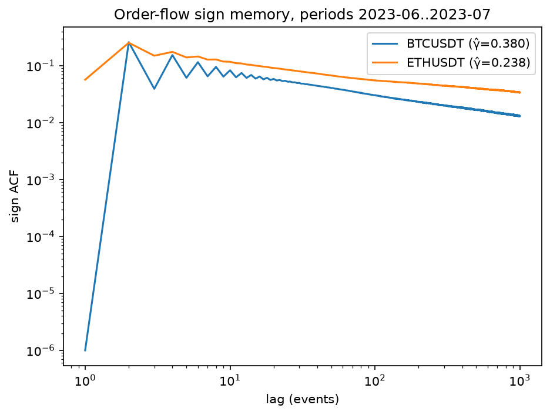
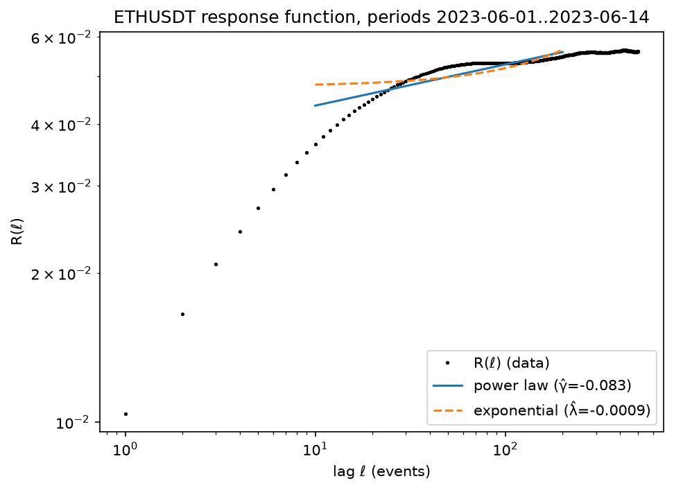
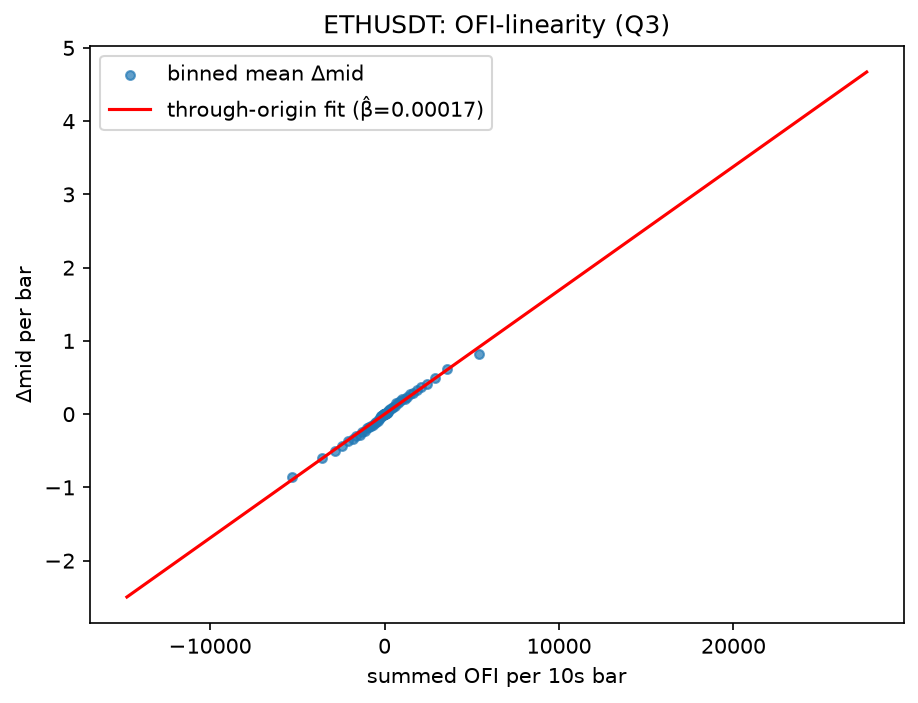

# Binance Market Microstructure

Empirical measurement of order-flow memory and price impact on Binance USDT-M perpetual futures,
from raw tick data. Three classical microstructure results — long-memory order flow, the price
response function, and order-flow-imbalance linearity — replicated on crypto and benchmarked
against the published equities literature.

This is a learning-first research project. Every Phase-1 result was chosen because a published
benchmark exists to check it against; novelty is explicitly not the goal. Each result is reported
with its sample period, sample size, standard error, and the specific reasons it might be wrong.

**If you are here to understand the concepts rather than run the code, read
[LEARNING.md](LEARNING.md)** — it explains the order book, autocorrelation, impact, OFI, and the
statistics behind every number below, and closes with an interview drill.

## Data

| | |
|---|---|
| Source | [data.binance.vision](https://data.binance.vision) public dumps (free, no account) |
| Market | USDT-M perpetual futures |
| Symbols | BTCUSDT, ETHUSDT |
| `aggTrades` | **105,147,096** raw prints — BTC + ETH, 2023-06 and 2023-07 |
| `bookTicker` | **114,231,299** L1 quote updates — ETH, **14 days**, 2023-06-01 to 2023-06-14 |
| Resolution | millisecond timestamps |
| Stored as | Parquet (~1.7 GB), lazily scanned with polars |

`aggTrades` carries `is_buyer_maker`, so the aggressor side is given rather than inferred — no
Lee-Ready or tick-rule classification error enters the sign series. The 14-day `bookTicker`
window is a hard data constraint, not a choice: Binance discontinued `bookTicker` dumps after
2024-04, and 2023-06 onward is where they overlap with `aggTrades`.

Raw prints are collapsed into **aggressor events** before any analysis — all same-millisecond,
same-side prints merge into one taker decision, because one market order sweeping several book
levels prints as several rows. Skipping this step inflates the lag-1 sign autocorrelation by a
factor of about 15; see [LEARNING.md §1](LEARNING.md#1-the-order-book-and-aggressor-trades).

## Results

### Q1 — Order flow has long memory



The autocorrelation of the buy/sell aggressor sign series, plotted log-log, where a power law
appears as a straight line. Both symbols show clear long memory: correlation is still visible at
lag 1000 and decays as `lag^(−γ)` rather than exponentially. **BTCUSDT γ̂ = 0.3803** (n =
38,046,362 events) sits inside the equities/futures range of 0.3–0.7 reported by Bouchaud et al.
(2004). **ETHUSDT γ̂ = 0.2380** (n = 25,773,466) sits below it — and since a smaller exponent
means slower decay, ETH's order flow is *more* persistent than typical equities, not less.
Falling outside the equity range is a finding rather than a failure; candidate explanations
(order splitting, retail herding, thinner books, or simply this two-month regime) are discussed
in LEARNING.md, and this data cannot yet distinguish them. The visible odd/even zigzag in BTC's
curve below lag ~20 is a short-lag alternation artifact and sits outside the [10, 500] fit
window's influence on the reported slope; the quoted stderrs are OLS and understate true
uncertainty because ACF values at adjacent lags are themselves correlated.

[Full results and caveats →](results/q1_results.md)

### Q2 — The response function rises, as long-memory flow predicts



The average mid-price move in the aggressor's direction, ℓ events after a signed trade.
**R(1) = 0.0104 rises to a plateau near 0.056 around ℓ ≈ 300–500 — a ratio of 5.39×.** Impact
does not decay here, and that is the expected shape rather than an anomaly: the measured response
R mixes the bare impact kernel G with order-flow memory C via `R(ℓ) ≈ G(ℓ) + Σ G(ℓ−n)·C(n)`. Only
G decays; with long-memory flow the accumulation term dominates, so R climbs. Bouchaud's own
equity response functions show the same rise before a slow decline. The quantitative check is the
strongest evidence in this project: Q1's ETH exponent γ ≈ 0.24 and the diffusivity-consistent
kernel exponent β = (1−γ)/2 ≈ 0.38 predict R(500)/R(1) in roughly the **3.5–6.9×** band, and the
independently measured **5.39×** falls inside it — two different datasets, two different
estimators, one consistent theory. Over lags 10–200 a power law fits better than an exponential
(log-scale RSS **0.2161 vs 0.4718**). This measures R only; separating the kernel G from flow
memory C requires propagator deconvolution, which is out of scope, and the sample is a single
14-day window for one symbol.

[Full results and caveats →](results/q2_results.md)

### Q3 — Price change is linear in order-flow imbalance, but explains less than in equities



Binned mean mid-price change against summed order-flow imbalance over 10-second bars, with a
through-origin fit. The relationship is clean and strikingly linear across the full range of
imbalance: **slope β̂ = 0.000169** over **120,960 bars**. But **R² = 0.4019, below the 65–70%
Cont, Kukanov & Stoikov (2014) report for equities.** The most likely reason is that Binance
`bookTicker` publishes only the best bid and ask, so our OFI is L1-only and blind to pressure at
deeper levels; 10-second bars and Silantyev's (2019) finding that trade-flow imbalance dominates
book OFI in crypto are the other candidates. The depth-scaling check is directionally right and
monotone — slope falls from 0.000303 in the thinnest depth quintile to 0.000125 in the thickest —
giving a **log-log exponent of −0.7741 against Cont's predicted −1**. That exponent is fit on
five points spanning barely a factor of three in depth, with no confidence interval, so treat it
as suggestive of the right direction rather than a measurement that rejects the theory.

[Full results and caveats →](results/q3_results.md)

## Reproducing from a fresh clone

### 1. Environment

```bash
git clone git@github.com:Varkot-dev/QR-Project.git
cd QR-Project
uv sync
```

Python 3.12+. Dependencies are polars, numpy, matplotlib, httpx; `uv sync` installs the dev group
(pytest, ruff) too.

### 2. Verify the code before trusting it

```bash
uv run pytest -m "not network" -q     # 67 tests: estimators vs synthetic ground truth
uv run ruff check src/ tests/
```

The estimators are validated against series with analytically known answers before touching real
data — i.i.d. signs (ACF exactly 0), a Markov chain (ACF = (2p−1)^k), FARIMA noise (γ = 1 − 2d),
and a known impact kernel the response estimator must recover. Add `-m network` to also run the
live smoke test against a real Binance dump file.

### 3. Download and ingest the data

Download, checksum-verify, and convert to Parquet. Every file is checked against Binance's
published SHA-256 and nothing reaches its canonical path unverified; both commands are idempotent,
so re-running skips what is already present.

```bash
# Monthly aggTrades: BTC + ETH, 2023-06 through 2023-07  (~0.9 GB as Parquet)
uv run python -c "
from pathlib import Path
from microstructure.data.catalog import sync
for sym in ('BTCUSDT', 'ETHUSDT'):
    sync(Path('data'), sym, 'aggTrades', '2023-06', '2023-07')
"

# Daily bookTicker: ETH only, 2023-06-01 through 2023-06-14
uv run python -c "
from pathlib import Path
from microstructure.data.catalog import sync_days
sync_days(Path('data'), 'ETHUSDT', 'bookTicker', '2023-06-01', '2023-06-14')
"
```

Optional integrity check — confirms `agg_trade_id` sequences have no gaps within a month and join
correctly across month boundaries:

```bash
uv run python -c "
from pathlib import Path
from microstructure.data.catalog import continuity_report
print(continuity_report(Path('data'), 'BTCUSDT', '2023-06', '2023-07'))
"
```

### 4. Run the three analyses

Each writes its `.png`, `.md`, and `.json` into `results/`. The defaults reproduce the figures
above exactly, so the flags below are shown only to make the sample explicit.

```bash
uv run python -m microstructure.analyses.q1_orderflow_memory \
    --root data --out results --symbols BTCUSDT,ETHUSDT --periods 2023-06,2023-07 --max-lag 1000

uv run python -m microstructure.analyses.q2_response \
    --root data --out results --symbol ETHUSDT \
    --start-day 2023-06-01 --end-day 2023-06-14 --max-lag 500

uv run python -m microstructure.analyses.q3_ofi \
    --root data --out results --symbol ETHUSDT \
    --start-day 2023-06-01 --end-day 2023-06-14 --window 10s
```

Q1 is the heaviest — it computes an FFT autocorrelation over 38M events per symbol. Q2 requires
the monthly `aggTrades` file covering the requested days plus every daily `bookTicker` file in
the range, and aborts if more than 1% of events fail to join a prior mid.

## Repo map

```
src/microstructure/
├── data/
│   ├── binance.py      # dump-file URLs; SHA-256 verified download with caching
│   ├── ingest.py       # zip-CSV → Parquet; sniffs header presence and ms-vs-µs epochs
│   ├── catalog.py      # sync / sync_days, integrity and continuity reports
│   └── events.py       # aggressor aggregation + the ±1 sign convention
├── signals/
│   └── load.py         # Parquet → analysis frames; strictly-prior mid join
├── estimators/
│   ├── acf.py          # FFT sign ACF (Wiener-Khinchin) + log-log power-law fit
│   ├── response.py     # R(ℓ) = E[s_t · (m_{t+ℓ} − m_t)]
│   └── ofi.py          # Cont-Kukanov-Stoikov OFI + through-origin OLS
├── analyses/
│   ├── q1_orderflow_memory.py   # → q1_*.png/.md/.json
│   ├── q2_response.py           # → q2_*.png/.md/.json
│   └── q3_ofi.py                # → q3_*.png/.md/.json
└── synthetic.py        # series with KNOWN properties, for estimator validation

tests/                  # pytest; estimators checked against synthetic ground truth
results/                # figures + per-question write-ups with methodology and caveats
research/               # annotated literature library + adversarial novelty verification
docs/superpowers/specs/ # design spec: goals, phases, data availability, honesty rules
LEARNING.md             # concepts, judgment calls, and the interview drill
```

`data/` is gitignored; the sync commands above rebuild it.

## Known limitations

Stated plainly, because they bound every number above:

- **Single regime.** Q1 covers two months; Q2 and Q3 a single 14-day window on one symbol.
  Nothing here establishes that results generalize across periods or volatility regimes.
- **Optimistic standard errors.** Every stderr reported is OLS, which assumes independent
  residuals. ACF values at adjacent lags share nearly all their data, and adjacent bars are
  autocorrelated, so all stated uncertainties are too small. Block-bootstrap intervals are the
  first queued rigor upgrade.
- **L1-only book data.** `bookTicker` gives one level, which plausibly explains both the low OFI
  R² and the depth-scaling exponent falling short of −1.
- **R, not G.** Q2 measures the response function; the impact kernel is never separated from
  flow memory.

## Literature

- **Bouchaud, Gefen, Potters & Wyart (2004)**, *Fluctuations and response in financial markets:
  the subtle nature of "random" price changes* — the response function, the propagator framing,
  the kernel-vs-response distinction, and the β = (1−γ)/2 diffusivity relation. Benchmarks Q1 and
  Q2.
- **Cont, Kukanov & Stoikov (2014)**, *The price impact of order book events* — the OFI
  construction, linearity, 1/depth scaling, and the 65–70% equities R². Benchmarks Q3.
- **Tóth, Lempérière, Deremble, de Lataillade, Kockelkoren & Bouchaud (2011)**, *Anomalous price
  impact and the critical nature of liquidity in financial markets* — square-root impact and the
  latent-liquidity picture behind the temporary/permanent distinction.
- **Silantyev (2019)** — BitMEX order flow; trade-flow imbalance outperforming book-based OFI in
  crypto, a candidate explanation for the Q3 R² gap.

`research/` holds the fuller annotated library, including
`04-novelty-verification-verdicts.md` — three agents tasked with *refuting* this project's
novelty claims. Their verdict: the Phase-1 core is well-trodden, which is the desired property
for a project whose goal is learning against published answer keys.

## Status

Phase 1 (Q1–Q3) complete. Next: block-bootstrap confidence intervals, disjoint-period reruns,
a Q3 bar-length sweep, and a signed-trade-volume comparison against book OFI — all of which use
data already on disk. Phase 2 carries the same machinery to a cross-section of Binance perp pairs.
